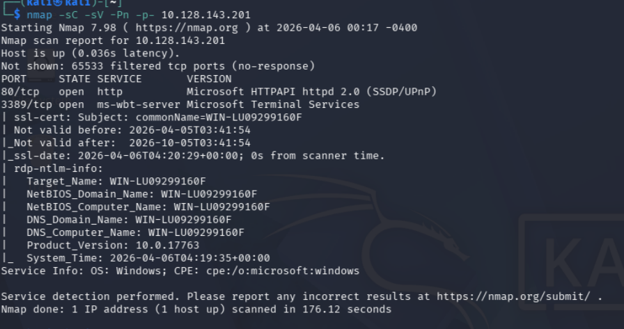
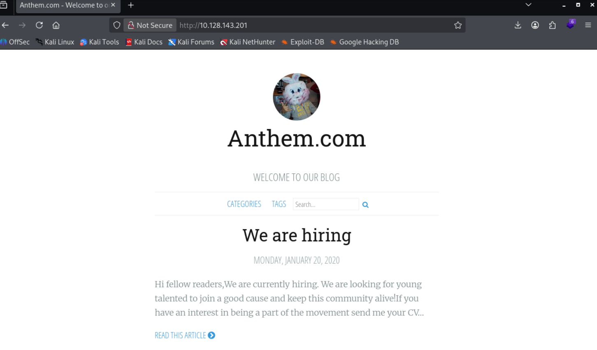
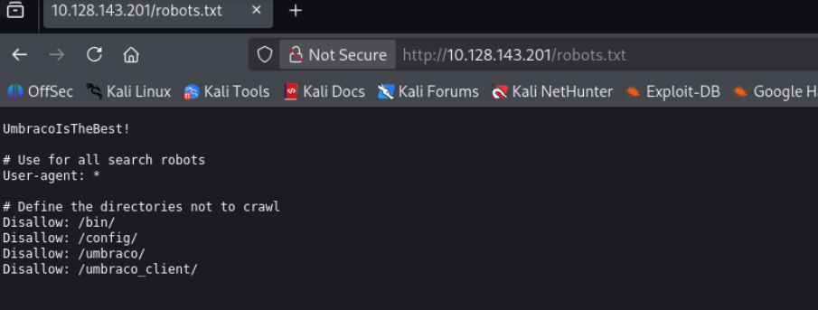
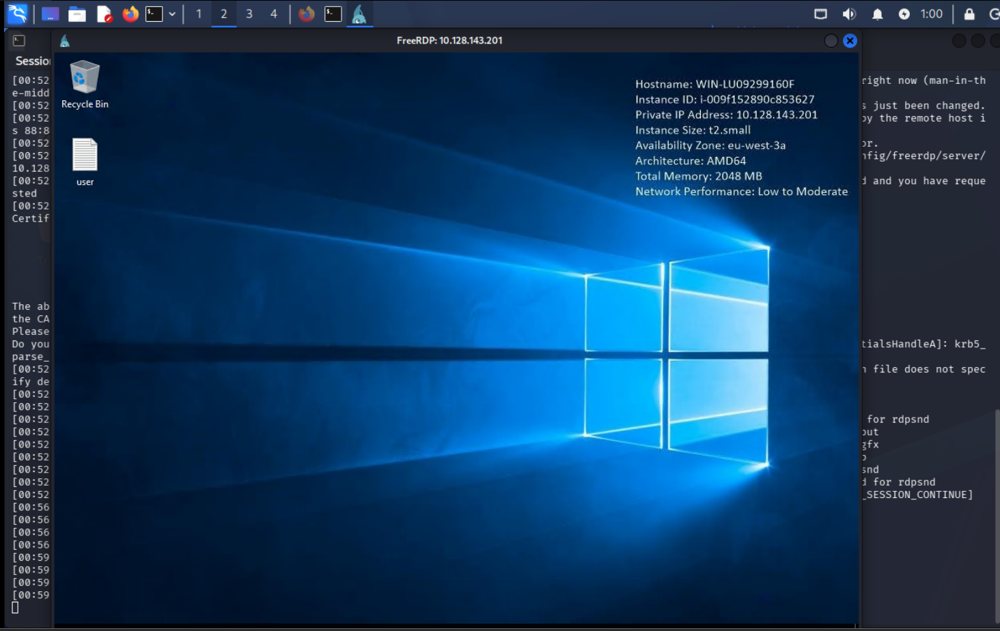
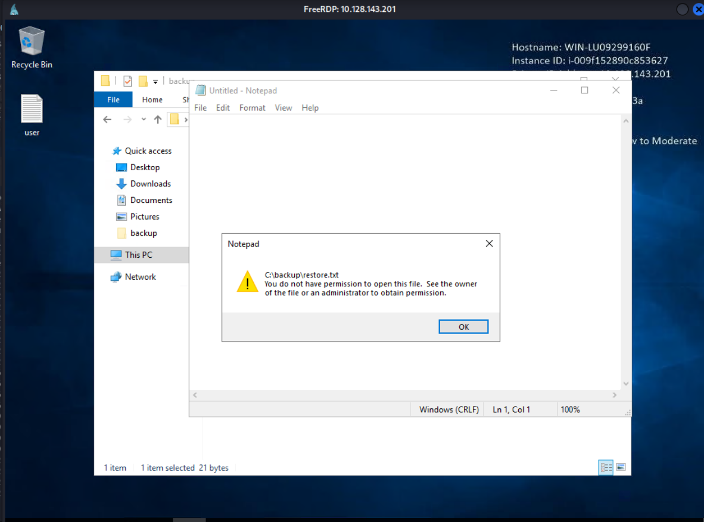
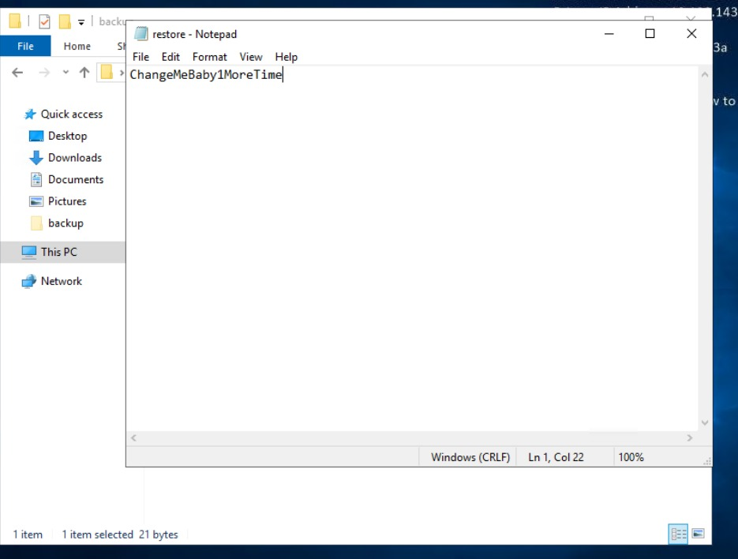
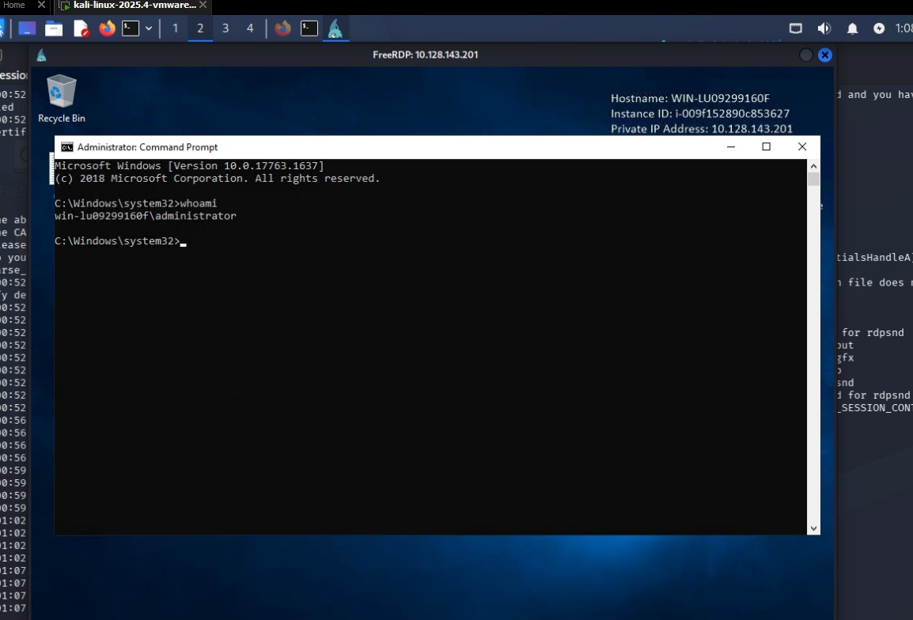

# Anthem - Writeup

| Plataforma | S.O. | Dificultad | IP Objetivo | Temas Clave |
| :--- | :--- | :--- | :--- | :--- |
| TryHackMe | Windows | Fácil | `10.128.143.201` | Robots.txt, Umbraco, RDP, Backup recovery, Admin cmd |

## Reconocimiento y Enumeración

### Escaneo de puertos

```bash
nmap -sC -sV -Pn -p- 10.128.143.201
```



Se detecta una página web en el puerto 80:


En uno de los posts aparece el correo `JD@anthem.com`.

### robots.txt y Umbraco

Revisando robots.txt:


Se encuentra la cadena `UmbracoIsTheBest!` y un disallow a `/umbraco`, que lleva a un login.

### Enumeración de usuarios

Otro post menciona a "Solomon Grundy". El correo del administrador sería `SG@anthem.com`.

## Explotación

### Acceso por RDP

Probando credenciales:

**Usuario:** SG

**Contraseña:** UmbracoIsTheBest!

```bash
xfreerdp /u:SG /p:UmbracoIsTheBest! /v:10.128.143.201
```



## Post-Explotación y Escalada de Privilegios

### Escalada de privilegios

Se encuentra una carpeta oculta `backups` con un archivo `restore` sin permisos de lectura:


Se otorgan permisos al usuario SG:


Encontramos  la palabra "ChangeMeBaby1MoreTime" dentro del archivo restore.

Despues de probar distintas cosas, probamos a ejecutar una cmd como administrador y probar esa frase como contraseña, y efectivamente es la contraseña del administrador.



## Mitigación y Recomendaciones

1. **No exponer secretos en archivos públicos**: Asegurarse de que contraseñas, tokens o frases de seguridad no estén documentadas ni guardadas en archivos públicos como `robots.txt` o páginas estáticas del sitio web.
2. **Principio de Mínimo Privilegio (Acceso a Archivos)**: Restringir de forma estricta los permisos de lectura sobre carpetas de respaldos (backups) y archivos de restauración. Solo cuentas de servicio específicas de respaldo o administradores del sistema deben tener acceso a leer o modificar estos directorios.
3. **Políticas de no reutilización de contraseñas**: Evitar el uso de la misma contraseña (como en este caso, la contraseña encontrada en el CMS) para el acceso administrativo al sistema operativo (RDP).
4. **MFA (Autenticación Multifactor)**: Habilitar MFA tanto en el portal de Umbraco CMS como para los accesos remotos por RDP.

